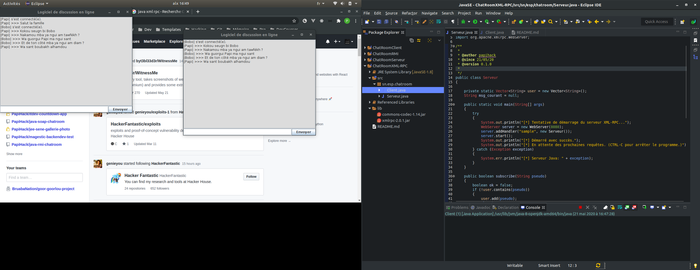

# Java XML-RPC ChatRoom

Un simple ChatRoom ou salon de discussion en français, avec `Java` et l'interface de programmation `XML-RPC`.

## Architecture du projet

Le projet est constitué d'un seul `package` nommé `sn.esp.chatroom` avec les classes suivantes :

- `Serveur` contient tout ce qui concerne le serveur.

- `Client` contient tout ce qui concerne la partie client comme l'interface graphique.

Il existe un dossier `lib` à la racine du projet contenant quelques dépendances nécessaires au bon fonctionnement du projet.

## Notes

Démarrez d'abord le serveur, puis autant d'instances clientes que vous le souhaitez.

Bon chat !!!!

